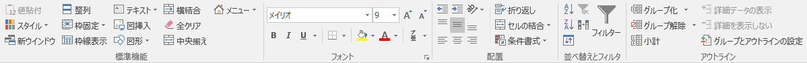

# Addin For Excel Library [Ladex]

-0078D6.svg?logo=windows&style=flat)
-217346.svg?logo=microsoft-excel&style=flat)
-217346.svg?logo=microsoft-excel&style=flat)
-217346.svg?logo=microsoft-excel&style=flat)

Addin For Excel Library　の造語でLadex[ラデックス]と読みます

## 動作環境
* Windows 10 (64bit)
* Microsoft Office 2013 (32/64bit)
* Microsoft Office 2016 (32/64bit)
* Microsoft 365 (64bit)

## 機能

### 専用のリボンメニューから処理  

|#|メニュー名|機能|
|---|---|---|
|1|Option|オプション設定|
|2|お気に入り||
|3|&nbsp;&nbsp;&nbsp;&nbsp;お気に入りに追加||
|4|&nbsp;&nbsp;&nbsp;&nbsp;お気に入り一覧||
|5|ブック管理||
|6|&nbsp;&nbsp;&nbsp;&nbsp;スタイル削除|登録されているスタイルを規定のスタイルに置き換えます|
|7|&nbsp;&nbsp;&nbsp;&nbsp;名前定義削除|登録されているセルの名前定義をすべて削除します|
|8|&nbsp;&nbsp;&nbsp;&nbsp;画像設定||
|9|R1C1表記|表記をR1C1 形式にします|
|10|シート一覧|シートの一覧を表示します。|
|11|画面設定||
|12|&nbsp;&nbsp;&nbsp;&nbsp;セル選択|アクティブシートをA1セルを選択された状態にします|
|13|&nbsp;&nbsp;&nbsp;&nbsp;セル選択＆保存|上記処理を実行後、上書き保存します|
|14|&nbsp;&nbsp;&nbsp;&nbsp;全セル表示|フィルターや非表示となっているセルを全て表示します|
|15|&nbsp;&nbsp;&nbsp;&nbsp;セルとシート選択|全シートをA1セルを選択された状態にします|
|16|&nbsp;&nbsp;&nbsp;&nbsp;セルとシート＆保存|上記処理を実行後、上書き保存します|
|17|&nbsp;&nbsp;&nbsp;&nbsp;標準画面|全シートをオプションで設定した内容で設定します|
|18|ズーム|セルの内容を別画面で表示し、編集を容易にします|
|19|&nbsp;&nbsp;&nbsp;&nbsp;全画面表示|リボンメニュー等を非表示にし、ブックを最大化します|
|20|ハイライト|アクティブセルを行/列方向に目立つようにします|
|21|セル調整||
|22|&nbsp;&nbsp;&nbsp;&nbsp;幅|幅を自動調整します|
|23|&nbsp;&nbsp;&nbsp;&nbsp;高さ|高さを自動調整します|
|24|&nbsp;&nbsp;&nbsp;&nbsp;両方|幅/高さを自動調整します|
|25|コメント整形|コメントに背景色を設定します|
|26|数式確認|数式として選択されているセルをわかりやすくします|
|27|数式編集||
|28|&nbsp;&nbsp;&nbsp;&nbsp;エラー防止|#N/A等、数式エラーが発生しないようにif文を追加します|
|29|文字編集||
|30|&nbsp;&nbsp;&nbsp;&nbsp;前後のスペース削除|選択中のセルの文頭、文末のスペースを削除します|
|31|&nbsp;&nbsp;&nbsp;&nbsp;文頭に・を追加|選択中のセルの文頭に「・」を追加します|
|32|&nbsp;&nbsp;&nbsp;&nbsp;文頭に連番を追加|選択中のセルの文頭に１からの連番を設定します|
|33|画像保存|選択中のセル、グラフ等を画像(PNG形式)として保存します|

一部の機能を抜粋しています

### ユーザー定義関数
  |関数名| 説明 |
  |---|---|
  | chkWorkDay | 第N営業日かチェックし、True/Falseを返す|
  | chkWeekNum | 第N週X曜日の日付かチェックし、True/Falseを返す|
  | getWorkDay | 第N営業日をシリアル値で返す|
  | Textjoin | 文字列連結|
  
  ※ 現時点では当年、翌年のみ対応

### 作成予定(作成中含む)
* 画像設定

## よく使う標準機能のメニューをまとめたもの

## 使用制限

* ハイライト  
&nbsp;行方向の最大値：11270行
&nbsp;列方向の最大値：EDK列

* ズーム  
&nbsp;文字色が設定されている場合、クリアされる

* 数式確認  
&nbsp;異なるシートにあるセルは対象外

## 参考サイト
[RelaxTools Addin](https://software.opensquare.net/relaxtools/)  
[Excelでお仕事!](http://www.ne.jp/asahi/excel/inoue/)  
[moug モーグ](https://www.moug.net/)  
[Office TANAKA](http://officetanaka.net/)  
[エクセルの神髄](https://excel-ubara.com/)  

## サポート
当ソフトはフリーソフトウェアです。   
個人・法人に限らず利用者は自由に使用および配布することができますが、著作権は作者にあります。   
当ソフトを使用した事によるいかなる損害も作者は一切の責任を負いません。

ソースを利用する場合にはMITライセンスです。
