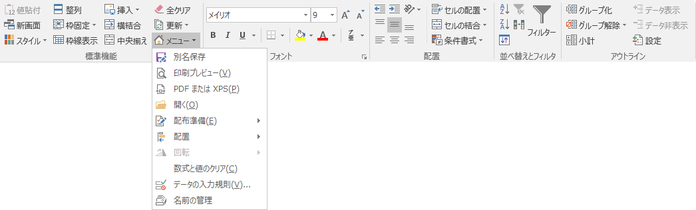

# BK_Library Addin For Excel

-0078D6.svg?logo=windows&style=flat)
-217346.svg?logo=microsoft-excel&style=flat)

Ladex(ラデックス)

## 動作環境
* Windows 10 64Bit
* Microsoft Office 2016 32Bit

## 機能

### 専用のリボンメニューから処理  

* A1セルに移動(アクティブシートのみ、全シート。移動のみ、移動後上書き保存)
* 名前の定義削除・設定
* スタイルの削除・設定
* ファイルのお気に入り登録
* セルの内容を拡大表示
* セルのハイライト
* R1C1表示への変更
* 罫線
* 表示設定(A1セルに移動、全シートA1セルに移動)
* 数式確認(SUM,SUBTOTAL なんかの範囲確認)
* 数式にIFERRORを追加し、『#VALUE!』『#DIV/0!』『#N/A!』の防止
* コメントのスタイル変更
* 選択範囲を画像として保存
* ユーザー定義関数
  |関数名| 説明 |
  |---|---|
  | chkWorkDay | 第N営業日かチェックし、True/Falseを返す|
  | getWorkDay | 第N営業日をシリアル値で返す|
  | chkWeekNum | 第N週X曜日の日付をシリアル値で返す|
  | Textjoin | 文字列連結|
  ※ 当年、翌年のみ対応

#### 作成予定(作成中含む)
* 画像設定
* サンプルデータ生成
* 電子印鑑(済、確認印、日付つき印)

### よく使う標準機能のメニューをまとめたもの

## 既存バグ

* ハイライト機能で、仕様上の上限がある  
　行方向の最大値：11270行
　列方向の最大値：EDK列

## 参考サイト
[RelaxTools Addin](https://software.opensquare.net/relaxtools/)  
[Excelでお仕事!](http://www.ne.jp/asahi/excel/inoue/)  
[moug モーグ](https://www.moug.net/)  
[Office TANAKA](http://officetanaka.net)  
[エクセルの神髄](https://excel-ubara.com/)  
